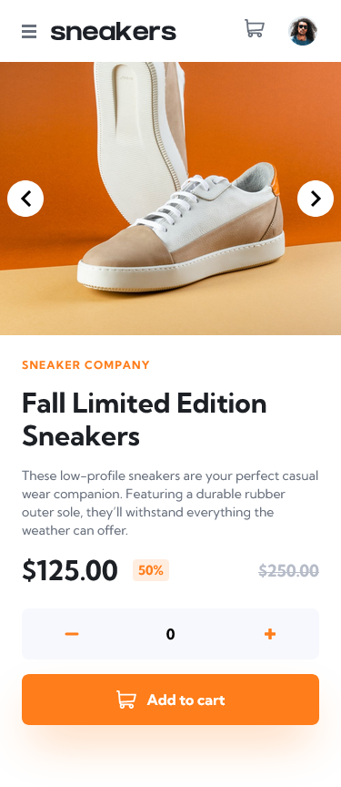
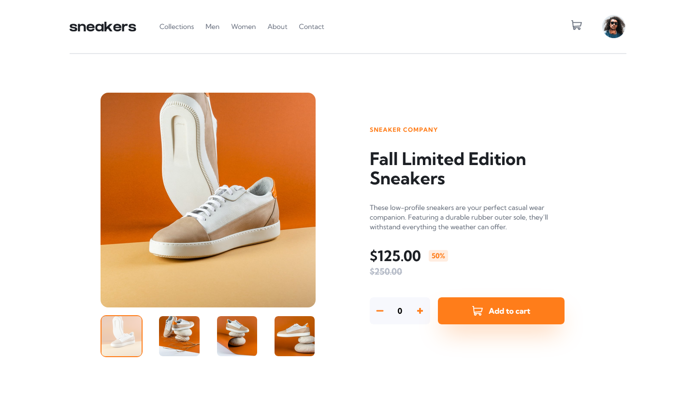

# Frontend Mentor - E-commerce product page solution

This is a solution to the [E-commerce product page challenge on Frontend Mentor](https://www.frontendmentor.io/challenges/ecommerce-product-page-UPsZ9MJp6). Frontend Mentor challenges help you improve your coding skills by building realistic projects.

## Table of contents

- [Frontend Mentor - E-commerce product page solution](#frontend-mentor---e-commerce-product-page-solution)
  - [Table of contents](#table-of-contents)
  - [Overview](#overview)
    - [The challenge](#the-challenge)
    - [Screenshot](#screenshot)
    - [Links](#links)
  - [My process](#my-process)
    - [Built with](#built-with)
    - [Continued development](#continued-development)
  - [Author](#author)

## Overview

### The challenge

Users should be able to:

- View the optimal layout for the site depending on their device's screen size
- See hover states for all interactive elements on the page
- Open a lightbox gallery by clicking on the large product image
- Switch the large product image by clicking on the small thumbnail images
- Add items to the cart
- View the cart and remove items from it

### Screenshot

### Links

- Solution URL: [code](https://github.com/tomhine/fm-ecomm-prod-page)
- Live Site URL: [live site](https://lustrous-lolly-d6915a.netlify.app/)

## My process

### Built with

- Flexbox
- CSS Grid
- Mobile-first workflow
- [Vue](https://vuejs.org/) - JS library
- [Astro](https://astro.build/) - Astro Framework
- [Tailwind CSS](hhttps://tailwindcss.com/) - For styles

### Continued development

I'd like to add some global keyboard events to close the light box modal and the cart menu.

## Author

- Frontend Mentor - [@tomhine](https://www.frontendmentor.io/profile/tomhine)
- Twitter - [@tomehine](https://www.twitter.com/tomehine)
